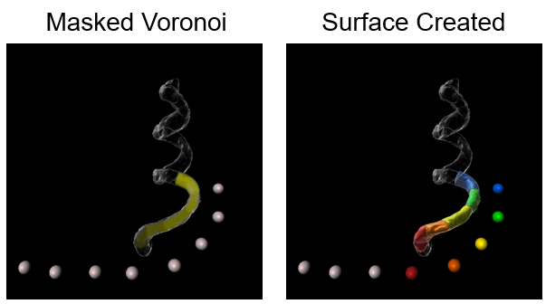
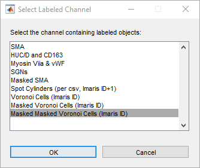
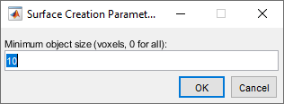
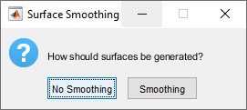
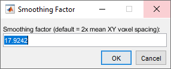
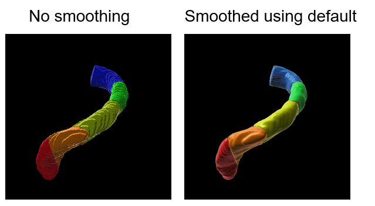
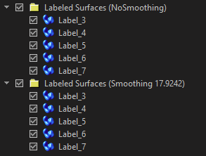

# CreateSurfacesFromLabeledMap — User Guide

**Script:** CreateSurfacesFromLabeledMap.m  
**Author:** Dr Ellie Cho, Biological Optical Microscopy Platform (BOMP), The University of Melbourne  
**Contact:** ellie.cho@unimelb.edu.au | bomp-enquiries@unimelb.edu.au  
**Version:** 1.0 — March 2026 | Tested in Imaris 10.2

## Manuscript
 
These scripts are described in full in the following manuscript, currently under preparation:
 
> Trang EP, Cho E, Wise A, Segal-Wasserman G, Fallon JB. *A detailed protocol for three-dimensional analysis of a chronically implanted and stimulated cochlea.* **Manuscript in preparation.**
 
A formal citation and DOI will be added here upon publication.

<br>

## Overview

This script reads a labeled image channel — a channel where each voxel's intensity identifies which object it belongs to — and creates a separate Imaris **surface object** for each unique intensity value. All resulting surfaces are collected into a folder in the Imaris scene.

The script is designed to work with channels produced by `SpotsVoronoiCreate.m` after masking, but it will work with any labeled channel where each label represents a distinct region of interest.

**Example use case:** After masking the Voronoi channel to the region of Rosenthal's canal in close proximity to the electrode array, this script converts each electrode-specific region into a surface object. The resulting surfaces can then be used with the **Find Spots Close to Surface** XTension to count auditory neurons within each electrode's spatial territory, or to measure tissue response volume per electrode.



## Prerequisites

- A **labeled image channel** in the current dataset (e.g., a masked Voronoi channel)
- Adequate RAM for your dataset size

<br>

## Installation

1. Copy `CreateSurfacesFromLabeledMap.m` into your Imaris XTensions folder
2. In Imaris: **Edit → Preferences → Custom Tools**, confirm the folder path is listed
3. Restart Imaris

The script is accessible from two locations depending on whether a surface object exists in the scene:
 
- **If a surface is already present:** select it, then go to **Surfaces → XT Tab → Create Surfaces from Labeled Map**
- **If no surface exists yet:** go to **Image Processing → Surfaces Functions → Create Surfaces from Labeled Map**
 
> **Note:** When accessing via the Surfaces XT tab, the surface you select does not affect the script's behaviour — any surface will do.

<br>

## Workflow

### Step 1: Prepare the labeled channel

Ensure your labeled channel has been masked appropriately before running this script. In the Voronoi tessellation workflow, this means completing both masking steps:

1. Surface-based masking (e.g., with Rosenthal's canal)
2. Spot-based masking with enlarged spots (if applicable)

The script will create one surface per unique non-zero intensity value in the selected channel. Background voxels (intensity = 0) are always ignored.

<br>

### Step 2: Run the script
 
If you have an existing surface object in the scene, select it and navigate to **Surfaces → XT Tab → Create Surfaces from Labeled Map**.
If no surface exists yet, access the script directly via **Image Processing → Surfaces Functions → Create Surfaces from Labeled Map**.

<br>


### Step 3: Channel selection dialog

**Dialog: "Select the channel containing labeled objects"**

A list of all channels in the current dataset is displayed. Select the channel you want to convert to surfaces — this should be your final masked Voronoi channel (or another labeled channel).

> **Tip:** If you have multiple masked Voronoi channels from different masking stages, make sure you select the most refined one (the result of the final masking step). Channel names are displayed as you have named them in Imaris, so using descriptive names (e.g., `Voronoi Cells (Surface + Spots Masked)`) makes this step straightforward.

**Example images**



<br>

### Step 4: Minimum object size dialog

**Dialog: Surface Creation Parameters — "Minimum object size (voxels, 0 for all)"**



<br>

| Field | Description | Default |
|---|---|---|
| Minimum object size (voxels) | Labels with fewer than this many voxels are skipped and no surface is created for them | 10 |

> **What is this for?**  
> After masking, some intensity values may survive as very small isolated groups of voxels — artefacts from the masking process, boundary effects, or noise. These produce small, fragmented surface objects that are not biologically meaningful. Setting a minimum voxel count (e.g., 10) filters these out.  
> Enter **0** to create a surface for every label regardless of size.

> **Choosing a threshold:**  
> A value of 10 voxels is appropriate for most datasets and will exclude single-voxel noise while retaining all genuine biological structures. If your dataset has very small but meaningful features, reduce this value. If you are seeing many spurious small surfaces in the output, increase it.

<br>

### Step 5: Smoothing dialog

**Dialog: "How should surfaces be generated?"**



<br>

| Option | Behaviour |
|---|---|
| **No Smoothing** | Surfaces follow the exact voxel boundaries of the labeled channel |
| **Smoothing** | Surfaces are smoothed using the Gaussian smoothing factor specified in the next dialog |

> **Which should I choose?**  
> - Use **No Smoothing** when surface boundaries must precisely match the labeled regions — for example, when the surface will be used to count spots or measure volumes where exact boundary fidelity matters. This is the recommended choice for the Voronoi tessellation workflow.  
> - Use **Smoothing** when you want surfaces for 3D visualisation purposes and a more anatomically natural appearance is preferred over strict boundary precision.

<br>

### Step 6: Smoothing factor dialog (if Smoothing was selected)

**Dialog: "Smoothing factor (default = 2x mean XY voxel spacing)"**



<br>

| Field | Description |
|---|---|
| Smoothing factor | The Gaussian smoothing radius applied during surface detection, in the same units as the dataset (typically micrometres) |

The default value is pre-calculated as **2× the mean XY voxel spacing** of your dataset. This is a conservative smoothing level that softens sharp voxel-step artefacts without significantly displacing the surface boundary.

> **Adjusting the smoothing factor:**  
> Larger values produce smoother surfaces but increasingly deviate from the actual labeled region boundary. Smaller values produce surfaces closer to the original voxel boundaries but may retain more surface roughness.  
> The default (2× mean XY voxel spacing) is a reasonable starting point for most datasets. Adjust based on visual inspection of the resulting surfaces.

**Example images**



<br>

### Step 7: Output

A folder is added to the Imaris scene, named to reflect the smoothing choice made:

- `Labeled Surfaces (NoSmoothing)` — if No Smoothing was selected
- `Labeled Surfaces (Smoothing X.XXXX)` — if Smoothing was selected, where X.XXXX is the smoothing factor applied

The folder contains one surface object per unique label in the selected channel. Each surface is named:

```
Label_1
Label_2
Label_3
...
```

where the number corresponds to the intensity value in the labeled channel (i.e., the spot index or Spot ID, depending on which intensity mode was used in `SpotsVoronoiCreate.m`).


<br>


> **Important:** Save your Imaris file immediately after the script completes.

<br>

## What happens next

With individual surface objects representing each electrode's region of interest, you can use the built-in Imaris **Find Spots Close to Surface** XTension to count neurons or measure distances:

1. Select a `Label_N` surface
2. Navigate to **Surfaces → XT Tab → Find Spots Close to Surface** (or equivalent XTension)
3. Select your spots (auditory neurons or other objects)
4. The script will identify which spots lie within the surface

Repeat for each surface, or use the Imaris batch processing tools if available.

For tissue response quantification, the volume of each surface object (available in the Imaris Statistics tab under **Volume**) gives the total tissue response volume associated with that electrode.

<br>

## Troubleshooting

| Problem | Likely cause | Solution |
|---|---|---|
| Script not visible in XT tab | No surface object in scene, or XTensions folder not configured | Create or select a surface; check Preferences → Custom Tools |
| "No surfaces were created" message | All labels below the minimum object size threshold | Lower the minimum size threshold, or enter 0 |
| Fewer surfaces than expected | Some labels excluded by minimum size filter | Reduce the minimum size threshold |
| Surfaces have very rough, stepped boundaries | No smoothing was applied | Re-run with Smoothing option if appearance is the priority (use No Smoothing for quantitative analysis) |
| Surfaces extend beyond the expected region | Masking was not applied before running this script | Ensure both masking steps are complete before running |
| Processing is slow | Large dataset with many labels | Allow the script to complete; progress is shown in the waitbar |
