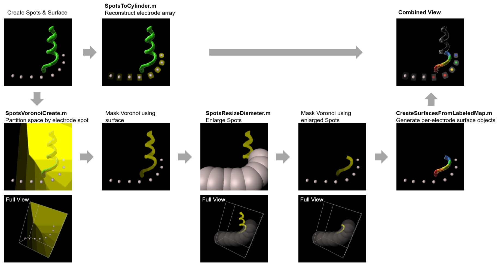

# Imaris XTension Suite — Cochlear Implant Analysis

Custom MATLAB XTension modules for Imaris 10.2, developed for three-dimensional analysis of cochlear implant tissue response and auditory neuron distribution from light-sheet fluorescence microscopy (LSFM) data.

 

## Author

**Dr Ellie Cho**  
Biological Optical Microscopy Platform (BOMP), The University of Melbourne  
ellie.cho@unimelb.edu.au | bomp-enquiries@unimelb.edu.au

 

## Manuscript

These scripts are described in full in the following manuscript, currently under preparation:

> Trang EP, Cho E, Wise A, Segal-Wasserman G, Fallon JB. *A detailed protocol for three-dimensional analysis of a chronically implanted and stimulated cochlea.* **Manuscript in preparation.**

A formal citation and DOI will be added here upon publication.

 

## Compatibility

| Requirement | Version |
|---|---|
| Imaris | 10.2 |
| MATLAB | R2023b or later (with Imaris XT interface) |

 

## Installation

1. Download all `.m` files from this repository
2. Copy them into your Imaris XTensions folder (a dedicated folder in an accessible location, configured under **Edit → Preferences → Custom Tools** in Imaris)
3. Restart Imaris

All scripts will appear under the **XT Tab** of the relevant Imaris object (Spots or Surfaces).

 

## Scripts

These four scripts form a connected analysis workflow but can each be used independently.

### 1. `SpotsToCylinder.m`
**Access:** Spots → XT Tab → Create Cylinders from Spots

Generates a new image channel where each spot is represented as a cylindrical intensity shape. The cylinder axis is oriented perpendicular to the local spot path direction. Cylinder diameter and thickness can be set uniformly for all spots, or specified per spot via a CSV file.

**Primary use:** Three-dimensional reconstruction of cochlear implant electrode contacts from manually identified electrode centres.

[→ User Guide](SpotsToCylinder_User_Guide.md)

 

### 2. `SpotsVoronoiCreate.m`
**Access:** Spots → XT Tab → Create Voronoi Channel

Generates a 3D Voronoi tessellation from a spots object, creating a labeled image channel where each voxel's intensity identifies its nearest spot. Endpoint extrapolation using ghost points improves boundary accuracy at the array terminals. Large datasets are handled via 10-slice chunked processing.

**Primary use:** Partitioning three-dimensional cochlear space into electrode-specific regions of interest for spatially resolved quantification of auditory neurons and tissue response.

[→ User Guide](SpotsVoronoiCreate_User_Guide.md)

 

### 3. `SpotsResizeDiameter.m`
**Access:** Spots → XT Tab → Resize Spots to Diameter

Creates a new spots object where all spots are resized to a uniform diameter. Positions, time indices, and colour are preserved from the original.

**Primary use:** Creating enlarged spot volumes for use as a spatial proximity mask on the Voronoi channel, restricting analysis to tissue regions within a defined distance of the electrode array.

[→ User Guide](SpotsResizeDiameter_User_Guide.md)

 

### 4. `CreateSurfacesFromLabeledMap.m`
**Access:** Surfaces → XT Tab → Create Surfaces from Labeled Map

Reads a labeled image channel and creates a separate Imaris surface object for each unique intensity value. Surfaces are collected into a folder in the Imaris scene. Smoothing is optional and user-controlled.

**Primary use:** Converting the masked Voronoi channel into individual surface objects representing each electrode's region of interest, enabling per-electrode quantification of auditory neuron count and tissue response volume.

[→ User Guide](CreateSurfacesFromLabeledMap_User_Guide.md)

 

## Workflow overview

Detailed step-by-step instructions for each script, including all user dialog options, are provided in the individual user guides linked above.

 

## Repository contents

| File | Description |
|---|---|
| `SpotsToCylinder.m` | Script: cylinder generation from spots |
| `SpotsVoronoiCreate.m` | Script: Voronoi tessellation channel |
| `SpotsResizeDiameter.m` | Script: uniform spot resizing |
| `CreateSurfacesFromLabeledMap.m` | Script: surface creation from labeled channel |
| `SpotsToCylinder_User_Guide.md` | User guide: SpotsToCylinder |
| `SpotsVoronoiCreate_User_Guide.md` | User guide: SpotsVoronoiCreate |
| `SpotsResizeDiameter_User_Guide.md` | User guide: SpotsResizeDiameter |
| `CreateSurfacesFromLabeledMap_User_Guide.md` | User guide: CreateSurfacesFromLabeledMap |
| `CSV Examples/` | Example CSV files for SpotsToCylinder per-spot parameter mode |
| `Images/` | Example images and screenshots for user guides |
| `LICENSE` | CC BY 4.0 licence |

---
 
## Licence

This work is licensed under the [Creative Commons Attribution 4.0 International Licence](LICENSE).  
You are free to use, adapt, and redistribute these scripts provided appropriate credit is given.
