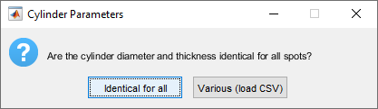

# SpotsToCylinder — User Guide

**Script:** `SpotsToCylinder.m`  
**Author:** Dr Ellie Cho, Biological Optical Microscopy Platform (BOMP), The University of Melbourne  
**Contact:** ellie.cho@unimelb.edu.au | bomp-enquiries@unimelb.edu.au  
**Version:** 1.0 — March 2026 | Tested in Imaris 10.2

## Manuscript
 
These scripts are described in full in the following manuscript, currently under preparation:
 
> Trang EP, Cho E, Wise A, Segal-Wasserman G, Fallon JB. *A detailed protocol for three-dimensional analysis of a chronically implanted and stimulated cochlea.* **Manuscript in preparation.**
 
A formal citation and DOI will be added here upon publication.
---

## Overview

This script generates a new image channel in Imaris where each spot is represented as a cylindrical intensity shape. The cylinder axis is oriented perpendicular to the local direction of the spot path, calculated from the original Imaris spot index order.

Cylinder dimensions (diameter and thickness) can either be set uniformly for all spots, or specified individually per spot via a CSV file. This makes the script suitable both for generic use and for applications requiring anatomically specific geometries, such as cochlear electrode array reconstruction.

**Example use case:** Reconstruction of cochlear implant electrodes. Each spot is placed at the manually identified centre of an electrode contact, and a cylinder of the corresponding electrode diameter and thickness is generated around it.

---

## Prerequisites

- At least one **Spots** object with a minimum of 2 spots
- If using per-spot parameters: a correctly formatted **CSV file** (see [CSV format](#csv-format))
- Adequate RAM for your dataset size

---

## Installation

1. Copy `SpotsToCylinder.m` into your Imaris XTensions folder
2. In Imaris: **Edit → Preferences → Custom Tools**, confirm the folder path is listed

The script will appear under: **Spots → XT Tab → Create Cylinders from Spots**

---

## Workflow

### Step 1: Place spots

Using the Imaris slice view, place a spot at the centre of each structure of interest. For cochlear electrode reconstruction, this means placing one spot at the approximate centre of each electrode contact, identified from the characteristic shadow produced by the platinum electrodes in the LSFM image.

Spots do not need to be placed in any particular spatial order, but note that the script processes them in the **original Imaris spot index order** — the order in which they were created. This order determines both the direction vectors used for cylinder orientation and the sequential intensity values written to the channel.

> **Minimum:** 2 spots are required.

---

### Step 2: Select the spots object

Select the spots object in the Imaris scene before running the script. If no spots object is selected, the script will automatically use the first spots object found in the scene.

---

### Step 3: Run the script

Navigate to **Spots → XT Tab → Create Cylinders from Spots**.

---

### Step 4: Cylinder parameters dialog

**Dialog: "Are the cylinder diameter and thickness identical for all spots?"**

| Option | When to use |
|---|---|
| **Identical for all** | All spots should have the same cylinder dimensions |
| **Various (load CSV)** | Each spot has a different diameter and/or thickness |

---

#### Option A: Identical for all spots

**Dialog: Cylinder Parameters**

| Field | Description | Default |
|---|---|---|
| Cylinder diameter (um) | The outer diameter of the cylinder, in micrometres | 500 |
| Cylinder thickness (um) | The height/depth of the cylinder along its axis, in micrometres | 300 |

> **Note on geometry:** The cylinder axis is oriented along the local spot direction vector. The *diameter* defines the width of the disc across its face, and the *thickness* defines how far the cylinder extends along the axis. For example, a 500 μm diameter and 300 μm thickness produces a disc 500 μm across and 300 μm deep.

**Example images**



---

#### Option B: Per-spot parameters via CSV

A file browser will open for you to select your CSV file.

##### CSV format

The CSV file must contain **three columns with no header row**:

| Column | Content |
|---|---|
| 1 | Imaris Spot ID |
| 2 | Cylinder diameter (μm) |
| 3 | Cylinder thickness (μm) |

One row per spot. Example:

```
0,500,300
1,480,300
2,470,300
3,450,300
```

**How to find Imaris Spot IDs:**  
In Imaris, select your spots object → go to the **Statistics** tab → select **Specific Values** → find the **ID** statistic. The IDs listed correspond to column 1 of the CSV.

**Spots not listed in the CSV:**  
Any spot whose ID does not appear in the CSV will be silently skipped. A message is printed to the MATLAB console for each skipped spot:
```
Spot ID 5: no CSV entry, skipped
```
This allows you to exclude specific spots from the output without modifying the spots object.

**Validation checks:**  
The script will stop and display an error message if:
- The CSV has fewer than 3 columns
- Duplicate Spot IDs are found in the CSV
- A CSV Spot ID does not match any spot in the current spots object

**Example images**

*[Insert image: example CSV file opened in a spreadsheet, showing the 3-column format with electrode-specific values]*

---

### Step 5: Intensity assignment dialog

**Dialog: "How should cylinder intensities be assigned?"**

This dialog determines what intensity value is written into the output channel for each cylinder.

| Option | Intensity value assigned | When to use |
|---|---|---|
| **Sequential (1, 2, 3...)** | 1 for the first spot in Imaris index order, 2 for the second, and so on | Default choice; produces a clean channel with values starting from 1 |
| **Match Imaris Spot ID (+1)** | The Imaris Spot ID of each spot, plus 1 | Use when downstream analysis requires matching back to specific Imaris-tracked spots |

> **Why "+1" for the Imaris Spot ID option?**  
> An intensity of 0 always represents background (no cylinder) in the output channel. If a spot has an Imaris ID of 0, writing that ID directly would make its cylinder indistinguishable from background. Adding 1 to all Imaris IDs shifts the range so that 0 is always reserved for empty voxels, and the lowest cylinder intensity is at least 1.

> **Which should I choose?**  
> For most workflows, **Sequential** is the simpler and recommended choice — the channel values start at 1, increase by 1 per spot, and are easy to interpret. Choose **Match Imaris Spot ID (+1)** only if you need to cross-reference the cylinder channel against other Imaris objects or statistics that use the same Spot IDs.

**Example images**

*[Insert image: the intensity assignment dialog box showing the two options]*

---

### Step 6: Bit depth warning (if applicable)

This dialog only appears when the maximum intensity value required exceeds the current dataset bit depth.

**Dialog: "The maximum intensity value exceeds the current dataset bit depth"**

| Option | Behaviour |
|---|---|
| **Upgrade to 16-bit** | The new channel is written at 16-bit depth, accommodating up to 65,535 intensity values |
| **Keep 8-bit (values above 255 will saturate)** | The channel stays at 8-bit; any intensity value above 255 is clipped to 255 |

> **When does this appear?**  
> - With **Sequential**, this dialog only appears if you have more than 255 spots.  
> - With **Match Imaris Spot ID (+1)**, this appears if any Spot ID + 1 exceeds 255 — which can happen if Imaris has assigned large ID numbers to your spots.  
> Upgrading to 16-bit is recommended whenever this dialog appears.

---

### Step 7: Output

A new channel is added to the Imaris dataset (yellow by default). The channel name encodes both the geometry parameters and the intensity mode:

| Parameters used | Example channel name |
|---|---|
| Uniform, sequential intensity | `Spot Cylinders (D=500um T=300um, sequential)` |
| Uniform, Imaris ID | `Spot Cylinders (D=500um T=300um, Imaris ID+1)` |
| Per-spot CSV, sequential intensity | `Spot Cylinders (per csv, sequential)` |
| Per-spot CSV, Imaris ID | `Spot Cylinders (per csv, Imaris ID+1)` |

Each cylinder's voxels carry the intensity value assigned to its spot (either sequential index or Imaris Spot ID + 1). Background voxels (outside all cylinders) have intensity 0. This makes the channel a labeled map that can be used directly for downstream masking or surface creation with `CreateSurfacesFromLabeledMap.m`.

The MATLAB console prints a summary:
```
=== Spot Cylinders Creation Complete ===
Total cylinders      : 8
Total planes created : 312
```

> **Important:** Save your Imaris file immediately after the script completes.

**Example images**

*[Insert image: Imaris channel display showing the completed cylinder channel overlaid on the LSFM image, with spots visible at the centre of each cylinder]*

*[Insert image: cross-sectional slice view showing that the cylinder correctly fills the electrode contact region]*

---

## Technical notes

**Spot processing order:**  
Cylinders are generated in the original Imaris spot index order (the order spots were created). This determines both the sequential intensity values and the direction vectors used for cylinder orientation. Unlike `SpotsVoronoiCreate.m`, this script does not reorder spots using a nearest neighbour algorithm.

**Direction calculation:**  
For each spot, the local direction vector is calculated from the centred difference between its predecessor and successor in the extended spot array. A ghost point is extrapolated one inter-spot distance beyond each endpoint to improve direction accuracy at the array terminals.

**Plane filling:**  
Each cylinder is constructed from a series of overlapping thin planes (thickness = 2× minimum voxel size) stacked along the cylinder axis. Adjacent planes overlap by at least one voxel, preventing gaps that would otherwise appear when the voxel size is large relative to the plane spacing.

**Intensity precedence:**  
Cylinders are drawn using the `max` operator — if cylinders from adjacent spots overlap, the higher intensity value is retained. This rarely occurs with well-spaced spots.

---

## Troubleshooting

| Problem | Likely cause | Solution |
|---|---|---|
| Script not visible in XT tab | XTensions folder not configured | Check Imaris Preferences → Custom Tools |
| "Need at least 2 spots" error | Fewer than 2 spots in object | Add more spots |
| Cylinders appear as flat discs | Thickness value is very small relative to diameter | Increase thickness, or check units (values are in micrometres) |
| "CSV Spot ID does not match" error | Spot IDs in CSV do not match current spots object | Export IDs from Imaris Statistics tab and rebuild CSV |
| Cylinders misaligned with structures | Spots placed at incorrect positions | Reposition spots in slice view |
| Intensities appear clipped | Spot IDs exceed 8-bit range | Re-run and choose "Upgrade to 16-bit" when prompted |
